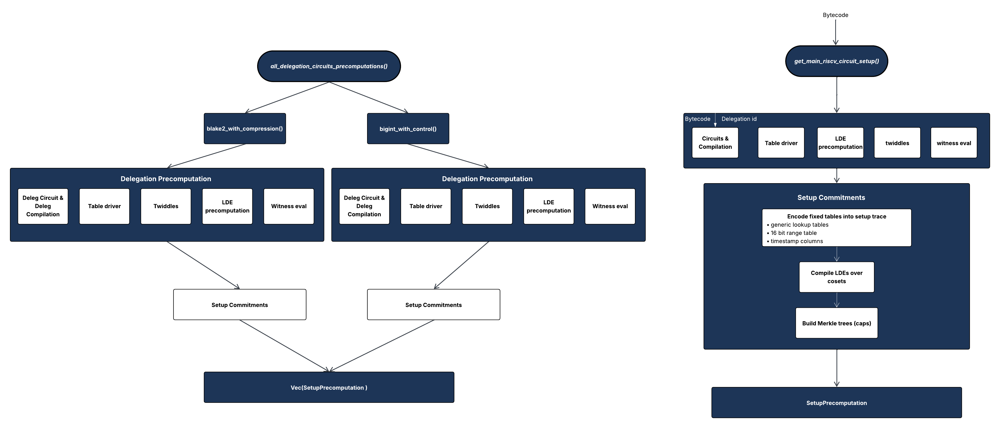

# Circuits
## Circuit entry points

For every circuit crate that lives under [`circuit_defs/`](../circuit_defs/), *entry-point* functions are intended to be the first place you look when you need to:

* Compile a circuit, either for proving or for generating a verifier,
* Obtain the lookup tables (`TableDriver`) belonging to a circuit,
* Bootstrap auxiliary artifacts (layout & quotient source files).
* Compile custom precompiles
* Call a witness generator

All of the circuit-setup signatures mentioned below are declared in each crate’s [`circuit_defs/setup/src/circuits`](../circuit_defs/setup/src/circuits). There are six different circuit setups (machines) you can invoke: 
1. `fn get_bigint_with_control_circuit_setup`.
2. `fn get_blake2_with_compression_circuit_setup`.
3. `fn get_final_reduced_riscv_circuit_setup`.
4. `fn get_main_riscv_circuit_setup`.
5. `fn get_reduced_riscv_circuit_setup`.
6. `fn get_riscv_without_signed_mul_div_circuit_setup`.

---

## Delegation circuits 

Any algorithm written in Rust can be compiled to RISC-V instructions and proven with the main machine circuits.  
However, some algorithms we use frequently—such as hashing inside Merkle trees—are far more efficient when implemented as dedicated circuits.  
To support this, we introduce custom CSR instructions that invoke so-called *delegation circuits*.  
Delegation circuits are small, self-contained gadgets that a RISC-V program can *call* via a dedicated CSR value.  
Each precompile, therefore, exposes a unique **`DELEGATION_TYPE_ID`** constant that must match the CSR value written by the program.

### `bigint_with_control` 

The main RISC-V machine circuit works on 32-bit words. When a program requires **256-bit** arithmetic, for example, to implement EVM‐style `ADD`, `MUL`, modular math or cryptographic primitives, expressing those operations directly inside the machine would reduce the gates.

Path: [`circuit_defs/bigint_with_control`](../circuit_defs/bigint_with_control)

| Constant | Value | Meaning |
|----------|-------|---------|
| `DELEGATION_TYPE_ID` | `1994` | CSR value identifying this delegation  |
| `DOMAIN_SIZE` | `1 << 21` | Native trace length of the circuit |
| `NUM_DELEGATION_CYCLES` | `DOMAIN_SIZE - 1` | Number of steps processed by one circuit instance |
| `TREE_CAP_SIZE` | `32` | Merkle cap size for memory commitments |

Entry-point functions:

1. `get_delegation_circuit() -> DelegationProcessorDescription` – compiles the circuit and returns the full description: trace length, lookup tables, compiled gates, etc.
2. `get_ssa_form() -> Vec<Vec<RawExpression>>` – produces a static single assignment form (SSA) graph of the constraints for debugging or visualization.
3. `get_table_driver() -> TableDriver<Mersenne31Field>` – builds the lookup tables.
4. `witness_eval_fn_for_gpu_tracer(proxy)` – function pointer used by the GPU tracer to fill in a witness.
5. `generate_artifacts()` – writes `generated/layout`, `generated/circuit_layout.rs`, and `generated/quotient.rs`.

### `blake2_with_compression`

RISC-V programs often rely on **BLAKE2s** hashing — for Merkle-tree commitments, transcript updates, or random oracle challenges.  The hash function’s 10-round compression consumes a lot of instructions; embedding it directly into the main machine circuit would reduce every cycle.

Path: [`circuit_defs/blake2_with_compression`](../circuit_defs/blake2_with_compression)

| Constant | Value | Meaning |
|----------|-------|---------|
| `DELEGATION_TYPE_ID` | `1987` | CSR value identifying this delegation  |
| `DOMAIN_SIZE` | `1 << 20`  | Native trace length of the circuit |
| `NUM_DELEGATION_CYCLES` | `DOMAIN_SIZE - 1` | Number of steps processed by one circuit instance |
| `TREE_CAP_SIZE` | `32` | Merkle cap size for memory commitments |

---

## Main RISC-V machine circuits

These circuits prove full execution traces of a RISC-V program under slightly different Instruction Set Architecture (ISA) configurations.  Instead of `DELEGATION_TYPE_ID`, they export a set of helper functions for building a **compiled machine**.

There are five concrete machine-mode types; each is a description of which RISC-V opcodes, CSR delegations, and exception handling logic the circuit supports. These configurations are used to prove complete RISC-V program execution end-to-end, and you choose one based on the ISA surface you need and whether your program calls delegation precompiles. In practice, full ISA variants are used for base proving, while reduced/minimal variants are used for recursion layers to keep proofs small.

1. `FullIsaMachineNoExceptionHandling`
    * Full IM32 instruction set (byte loads/stores, signed & unsigned multiplication/division, etc.).
    * No delegation CSRs.
    * Assumes “trusted” code – no traps or exceptions are ever raised, so the circuit omits exception-handling constraints.
2. `FullIsaMachineWithDelegationNoExceptionHandling`
    * Same full ISA as above, plus support for delegation CSR calls (BLAKE2 hash, BigInt operations).
    * No exception handling logic.
    * Supports delegations.
3. `FullIsaMachineWithDelegationNoExceptionHandlingNoSignedMulDiv`
    * Drops the signed multiply/divide & remainder opcodes (`MULH`, `MULHSU`, `MULH​U`, `DIV`, `REM`).
    * Keeps unsigned `MUL`, `DIVU`, `REMU`, and keeps all delegations.
   * Cheaper than the full machine.
    * Used in recursion.
4. `MinimalMachineNoExceptionHandling`
    * Word-aligned memory only (no LB/LH/SB/SH), no multiplication/division, no delegation CSRs.
    * Designed for proving or arithmetic code where big gadgets are unnecessary.
    * Smallest constraint system among non-delegation machines.
5. `MinimalMachineNoExceptionHandlingWithDelegation`
    * Same reduced opcode set as above, but in addition, allows using the BLAKE2 and BigInt delegation circuits too.
    * Good middle ground when your program avoids byte accesses and multiplication/division but still needs heavy crypto primitives.

Entry-point functions:
* **`formal_machine_for_compilation() -> Machine`** – returns a zero-configured value of the Rust *type-level* machine.
* **`get_machine(bytecode, csr_whitelist) -> CompiledCircuitArtifact`** – compile a machine for a concrete ROM image.
* **`get_table_driver(bytecode, csr_whitelist)`** – lookup tables only.
* **`witness_eval_fn_for_gpu_tracer(proxy)`** – GPU witness generator.
* **`generate_artifacts()`** – emit verifier layout & quotient code.

Where a ROM-size generic parameter is necessary, there is a second pair of helpers suffixed with **`_for_rom_bound`**.

Each crate exposes the exact same entry points listed above.  The only divergent parts are constant parameters such as `DOMAIN_SIZE`, `LDE_FACTOR`, `ALLOWED_DELEGATION_CSRS`, etc.

---

## Utility crate – `setups`  

Path: [`circuit_defs/setups`](../circuit_defs/setups)

The *setups* crate is a thin orchestrator that glues the individual circuits together.  It offers convenience helpers such as:

* `num_cycles_for_machine::<C>()`, `trace_len_for_machine::<C>()`.
* `delegation_factories_for_machine::<C>()` – obtain delegation witness factories matching a machine config.
* Ready-to-use *precomputations* (`MainCircuitPrecomputations` & `DelegationCircuitPrecomputations`) that bundle the compiled circuit, LDE twiddles, Merkle tree setup, etc.

If you need to spin up a prover quickly, start from `setups::get_delegation_compiled_circuits_for_default_machine()` or the corresponding helpers for other configurations.

---

### Visual: Setup creation

---
### TL;DR

* For **delegation circuits**, call `*_with_control::get_delegation_circuit()` (or the BLAKE2 variant) and keep the returned `DelegationProcessorDescription` around – everything you need is inside.
* For **main machine circuits**, call `get_machine(bytecode, csr_whitelist)` on the crate matching your ISA configuration.  Use `get_table_driver()` when you only need lookup tables.
* Use `witness_eval_fn_for_gpu_tracer` together with the GPU tracer to turn an execution trace into a full witness.
* Run `generate_artifacts()` whenever you change circuit code – it refreshes verifier layouts (vk`s) automatically. 
