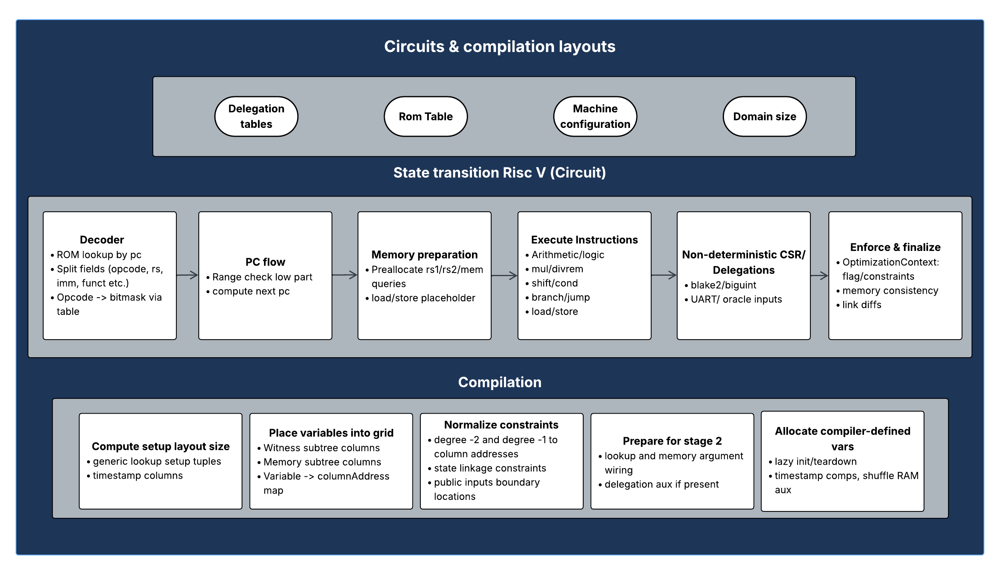

# Airbender Circuit Overview

This document provides a high-level overview of the Airbender proving system for RISC-V execution and then dives into key design patterns and the proving stages. If you just want the big picture, read this section. Later sections explain how each part is implemented and optimized.



### High‑level overview

We want to prove the deterministic execution of RV32I+M programs over a fixed number of cycles ($2^{22}$), in machine mode, with no exceptions due to the trusted‑code model —unsupported or invalid behavior makes constraints unsatisfiable. The bytecode lives in ROM, and registers are modeled as a dedicated address space inside a unified memory argument alongside RAM. They occupy a distinct address space (selected by `is_register = 1`), yet their accesses are encoded using the same `RegisterOrRam` queries and folded into the global shuffle memory argument.

#### State and data model

The system maintains minimal explicit state per row, typically only `pc` split into 16‑bit limbs. All register and memory values flow through a global shuffle RAM argument. Instruction fetches are separated ROM lookups keyed by `pc` (ROM != RAM). Branching and jumps update `pc` deterministically, and `x0` is enforced to remain zero.

Execution is chunked: Each chunk has a "lazy init" (initial values/timestamps) and "teardown" (final values/timestamps), linked across chunks to ensure continuity.

#### Constraints and arguments

**Generic constraints** include arithmetic/logic, control semantics, decoder, range checks, and delegation infrastructure compiled from the constraint system.

**Hardcoded constraints (Stage 3)** validate Stage 2 arguments (memory, lookups, delegation), boundary conditions, state linkage, ROM separation, lazy‑init sorting with the borrow trick, and per‑domain masking.

#### Performance/optimization philosophy

**Optimization Context with orthogonal selection**: The system computes candidate relations for many opcodes once, then selects the active one via mutually exclusive flags to achieve maximal reuse.

**Lookup‑centric design**: The system uses fixed‑table lookups (decoder, ROM, range checks) instead of complex arithmetic. This keeps constraint degrees low and makes GPU proving faster.

**Unified memory/register model**: A single shuffle argument ensures consistency, with lazy init/teardown for chunk linking. "First read" always matches an init or prior write.

## Optimization Context with orthogonal selection (we "execute all" and then choose one)

This optimization pattern lives in the main RISC-V circuit and is central to how instruction execution is encoded. Rather than having separate constraint paths for each opcode, the circuit uses a unified approach that dramatically reduces overhead.

The **core idea** is that, for each cycle, we prepare candidate computations for many instruction handlers, but every relation is guarded by mutually exclusive boolean flags. At enforcement time, we orthogonally select exactly one variant, the actual opcode, and ignore the rest. This reduces muxing cost and enables aggressive variable reuse.

### How it works

We accumulate relations in an `OptimizationContext` rather than immediately constraining each operation. Relations include addition/subtraction, multiplication/division, range checks, lookups, and is-zero checks, each with an `exec_flag` that marks when they are active.

Outputs are preallocated in reusable buffers. Non-taken branches may hold invalid witness values, but they never appear in constraints because we always mask by `exec_flag`. This saves variables and selectors.

During enforcement, we select from orthogonal variants based on the opcode flags, collapsing many candidate relations into the single active one. For table lookups, we build per-variant rows, then choose a single row by orthogonal flags and enforce one lookup.

### Indexers and buffers

The context keeps typed relation buffers and indexers to batch-enforce relations of the same shape. Outputs (registers, flags, lookup outputs) are preallocated and reused.

```70:99:zksync-airbender/cs/src/devices/optimization_context.rs
#[derive(Clone, Copy, Debug)]
pub struct OptCtxIndexers 
pub struct OptimizationContext<F, C> 
```

The `get_register_output` method allocates a fresh `Register` only when the pool is exhausted; otherwise, it reuses one.

```152:166:zksync-airbender/cs/src/devices/optimization_context.rs
pub fn get_register_output(&mut self, cs: &mut CS) -> Register<F> { /* reuse or Register::new(cs) */ }
```

### Appending relations

Each `append_*` function records a relation plus its `exec_flag` and assigns witnesses early via `cs.set_values`, often using `witness_early_branch_if_possible` to skip work on inactive branches.

```169:187:zksync-airbender/cs/src/devices/optimization_context.rs
pub fn append_add_relation(...)
```

```189:228:zksync-airbender/cs/src/devices/optimization_context.rs
pub fn append_is_zero_relation(...) -> Boolean { /* conditionally assigns, guarded by exec_flag */ }
```

```230:284:zksync-airbender/cs/src/devices/optimization_context.rs
pub fn append_mul_relation_unsigned(...) -> (Register<F>, Register<F>) { /* low/high, early branch */ }
```

```286:378:zksync-airbender/cs/src/devices/optimization_context.rs
pub fn append_mul_relation_ext(...) { /* signed, unsigned, and mixed cases */ }
```

```380:485:zksync-airbender/cs/src/devices/optimization_context.rs
pub fn append_mul_relation_raw(...) { /* four signedness combinations with masking */ }
```

```702:725:zksync-airbender/cs/src/devices/optimization_context.rs
pub fn append_lookup_relation(...) -> [Variable; N] 
```

```727:753:zksync-airbender/cs/src/devices/optimization_context.rs
pub fn append_lookup_relation_from_linear_terms(...) -> [Variable; N]
```

### Execute all, choose one

We call all instruction handlers to produce candidate diffs, then later select the one that matches the decoded opcode. The optimizer enforces only the active relations. The `enforce_all` method iterates relation types in a fixed order, and for each index selects inputs via `cs.choose_from_orthogonal_variants(&flags, ...)`. When specialization is possible, it uses a compact form; otherwise it builds masked accumulators and decomposes carries explicitly to stay at degree ≤ 2.

Early-branch witness assignment skips heavy computations on inactive branches:

```262:267:zksync-airbender/cs/src/devices/optimization_context.rs
witness_early_branch_if_possible(mask, placer, &evaluate_fn_inner);
```

### Benefits

This pattern yields **significant savings**:

- Fewer muxes and selectors: Selection happens once per relation type, not per wire
- Variable reuse: Preallocated registers/flags/bytes are recycled across operations
- Better for GPU: Uniform relation shapes are easier to fold in Stage 3

## Prover pipeline at a glance

See also the brief description in the philosophy doc: [philosophy_and_logic.md](./philosophy_and_logic.md).

- **Stage 1**
  - Low degree extension (LDE) of the witness and memory traces to the coset domain and commit on both main and coset.

- **Stage 2**
  - Evaluate memory, lookup (including range-check), and delegation arguments on the main domain.
  - LDE these argument columns to the coset domain and commit on both domains.

- **Stage 3**
  - Evaluate the constraint quotient on the coset domain; the *zerofier* denominators vanish on the main domain.
  - The quotient includes:
    - Generic constraints compiled from the constraint system (RISC-V op semantics, delegation internals, etc.).
    - A large set of hardcoded constraints (see [`prover/src/prover_stages/stage3.rs`](../prover/src/prover_stages/stage3.rs)) that glue together Stage 2 arguments, enforce boundary conditions, state linkage, lazy init sorting, and other per-domain masks.
  - NTT the quotient to the main domain and commit on both domains.

- **Stage 4**
  - Sample a random point `z` in `Ext4`.
  - Use barycentric evaluation to get evaluations of trace and argument polynomials at `z`.
  - Construct the DEEP quotient on the main domain from these evaluations.
  - LDE the DEEP quotient to the coset domain and commit on both domains.

- **Stage 5**
  - Perform FRI folding to build all FRI layers and commit to them.
  - Draw a challenge based on these commitments, combine it with a PoW nonce, and grind to obtain a valid seed for FRI queries.
  - Draw query points and construct queries.

## Optimized state transition 

In the minimal no-exceptions configuration, the state transition is built to leverage the optimization context and orthogonal selection end-to-end.

The process begins by initializing the minimal state and range-checking `pc` limbs as needed. The program counter (PC) will be split and rechecked by the decoder. The system then decodes once using the optimized decoder that pulls ROM bytecode, range-checks sub-chunks, computes opcode-format flags, and prepares memory queries.

Next, it precomputes `pc_next` and decomposes operands (`src1`, `src2`) with sign bits for opcodes that need signed arithmetic. The system applies every relevant instruction handler in sequence (`ADD`/`SUB`/…/`CSR`). Each handler writes candidate diffs guarded by its exec flag into the optimization context.

After all handlers have contributed, `opt_ctx.enforce_all(cs)` runs to select and enforce only the active relations. The system then performs write-back: it applies exactly one memory/register diff and updates `pc` to `pc_next` according to branch/jump logic, again guided by flags.

The decoder explicitly splits the high 16-bit limb of `pc` and applies range checks to those bits during table access. It then concatenates with the low limb to index the ROM/decoder tables. Pre-decoding, we range-check only `pc_low` to ensure both limbs are in range without duplicating checks.

Because `pc` is part of the explicit state and is linked row-to-row, its range is preserved across steps. ROM fetch enforces `pc % 4 == 0`, so alignment constraints for branches/jumps can be omitted and delegated to the ROM access itself.

### How the high limb is range-checked by the ROM read itself

```261:277:zksync-airbender/cs/src/machine/utils.rs
// read_opcode_from_rom: use RomAddressSpaceSeparator to check pc_high and separate ROM vs RAM
let [is_ram_range, rom_address_low] = cs.get_variables_from_lookup_constrained(
    &[LookupInput::from(pc.0[1].get_variable())],
    TableType::RomAddressSpaceSeparator,
);
// force ROM-only here (is_ram_range == 0)
cs.add_constraint_allow_explicit_linear(Constraint::<F>::from(is_ram_range));// join low limb with looked-up low bits
let rom_address_constraint = Term::from(pc.0[0].get_variable())
    + Term::from((F::from_u64_unchecked(1 << 16), rom_address_low));
// then read via RomRead lookup
let [low, high] = cs.get_variables_from_lookup_constrained(
    &[LookupInput::from(rom_address_constraint)],
    TableType::RomRead,
);
```

This means `pc_high` is validated via the `RomAddressSpaceSeparator` lookup, while `pc_low` is explicitly range-checked before decode. Together they guarantee `pc` is in range for ROM access without redundant checks.

## State linkage constraint

The VM carries a small explicit state between rows, typically the program counter split into limbs. The "linkage" constraint enforces that the state produced by the current row becomes the initial state of the next row.

For each state component, the constraint `state_out(current_row) − state_in(next_row) = 0` is enforced on every row except the last two. Boundary constraints expose the very first `state_in` and the final `state_out` as public inputs.

### How it is compiled

```1608:1626:zksync-airbender/cs/src/one_row_compiler/compile_layout.rs
// public inputs at FIRST and one-before-last row
// we should add our only single linking constraint to link state -> state
linking_constraints.push((*f, *i));
public_inputs_first_row.push((BoundaryConstraintLocation::FirstRow, *i));
public_inputs_one_row_before_last.push((BoundaryConstraintLocation::OneBeforeLastRow, *f));
```

### How Stage 3 enforces it

Stage 3 enforces this everywhere except on the last two rows:

```2742:2767:zksync-airbender/prover/src/prover_stages/stage3.rs
// linking constraints: src(this) - dst(next) == 0 over the domain mask
let mut diff = read_value(*src, witness_trace_view_row, memory_trace_view_row);
let dst_value = read_value(*dst, witness_trace_view_next_row, memory_trace_view_next_row);
diff.sub_assign(&dst_value);
add_quotient_term_contribution_in_ext2(&mut every_row_except_last_two_challenges_ptr, term_contribution, &mut quotient_term);
```

## What is "hardcoded" in Stage 3 and why

Stage 3 folds constraints into the quotient polynomial. The hardcoded set includes:

- State linkage constraints (described above), masked to "every row except last two"
- Memory argument terms: grand-product updates and consistency checks for RAM/register accesses
- Lookup argument multiplicities: timestamp and generic lookup multiplicity accumulators
- Delegation requests/processing
- Shuffle RAM initialization and teardown ordering
- Batched RAM accesses and register/indirect access consistency
- Boundary contributions for first and one-before-last rows (handled via a dedicated structure)

## Boundary constraints and public inputs

Only three boundary categories are needed:

- Initial state at the first row (public input)
- Final state at the one-before-last row (public input)
- Lazy init addresses for the memory argument, which are handled manually and not added as boundary constraints

## Unified memory/register argument — why reads need no extra range checks

Every register and RAM access is recorded as a ShuffleRam query. In the state-transition, we pre-build three per-cycle queries (RS1 read, RS2 read-or-RAM, RD/STORE), keeping shapes fixed and predictable for later stages.

Stage 2 constructs the randomized memory argument over all recorded accesses. Stage 3 consumes the accumulator and enforces the memory argument, together with lazy init/teardown boundary conditions for the shuffle RAM initialization.

The consequence is that since writes are range-checked at the point of creation, and the shuffle argument forces each read to equal some earlier write or an initialization value, every read value necessarily inherits the same range bound. Therefore, we do not re‑range‑check values on reads. When an opcode requires finer granularity, for example, byte or bit-level behavior, it adds the necessary local checks at that point.

This is why sections like RS1/RS2 operand preparation explicitly skip range checks on read values.

## Verifier folding for register lazy init and teardown

The verifier explicitly folds in the lazy-init/teardown contributions for registers during statement verification:

- See: [full_statement_verifier/src/lib.rs (lines 379–387)](https://github.com/matter-labs/zksync-airbender/blob/main/full_statement_verifier/src/lib.rs#L379-L387)

The function that computes these contributions (used by the prover/verification plumbing) is documented here:

- See: [prover/src/definitions/mod.rs (lines 297–355)](https://github.com/matter-labs/zksync-airbender/blob/main/prover/src/definitions/mod.rs#L297-L355)

This ties the register portion of the lazy init/teardown into the same global memory/register argument, ensuring cross-chunk consistency at verification time.

### Design notes and assumptions

The number of actually used lazy-init and teardown entries must equal the number of unique RAM/register addresses accessed by the program within the chunk. This ensures every address has exactly one origin (init) and one final value (teardown) for linking across chunks.

We assume the number of unique accessed addresses is ≤ the number of cycles, so the init/teardown sets fit into the per-chunk segments provisioned in the trace layout. In theory, a program could access more unique addresses than cycles, leading to an overflow of the reserved segments. We classify this as a pathological case and exclude it by design.

The init and teardown ingredient terms are laid out across segments for the whole program with monotonically increasing address entries. They may be laid out continuously without caring about segment splits, because only their inclusion in the global memory product matters; segmentation is purely organizational for the trace.

## Lazy init/teardown columns and monotonicity

### Dedicated columns

The field elements that contribute to lazy‑init and teardown entries live in their own dedicated columns. These columns can be split into row‑chunks arbitrarily. What matters is that every entry participates in the global memory grand product. Practically, we place them alongside per‑cycle columns even though a row's lazy‑init/teardown cells are not semantically tied to that row's per‑cycle witness.

### Uniqueness via monotonic addresses

To ensure uniqueness of lazy‑init/teardown addresses, we enforce strict monotonic increase of the address sequence.

**Within a segment**: A constraint enforces that each address is larger than the previous one. This aligns with the "sorting with borrow" trick used for lazy‑init ordering in Stage 3.

**Across segments**: The verifier manually checks boundaries when stitching proofs, ensuring that the last address of segment `n` is strictly less than the first address of segment `n+1`.

### Padding strategy

Programs typically touch far fewer unique addresses than there are active rows. We therefore pad the ingredient columns. We pre‑pad with zeros at the beginning, instead of padding at the end, to simplify the monotonicity constraint. A dedicated carry/enable bit deactivates the monotonic‑increase check on padding rows, while keeping it active for the real entries.

These choices make lazy‑init/teardown columns easy to split and merge across segments while preserving a simple, globally consistent ordering that the prover enforces locally and the verifier checks at boundaries.

See also a visual overview in the ZKsync Airbender slides: [memory layout slide](https://docs.google.com/presentation/d/1mCCsz5uQQEjlf2BI5vPZ0Gf5Sex6f0oKDkrvdaE-tXY/edit?slide=id.g3315c18d5c8_0_19#slide=id.g3315c18d5c8_0_19).

## ROM vs RAM

- ROM is a separate read-only region accessed via dedicated lookups (`RomAddressSpaceSeparator` → `RomRead`) and enforced with `is_ram_range == 0`. It is not part of the RAM/register shuffle argument.
- RAM/register accesses alone participate in the shuffle RAM argument. Loads/stores are constrained to RAM by the separator, and ROM writes are impossible.
- Opcode fetches always come from ROM and are not mixed with general RAM reads.
